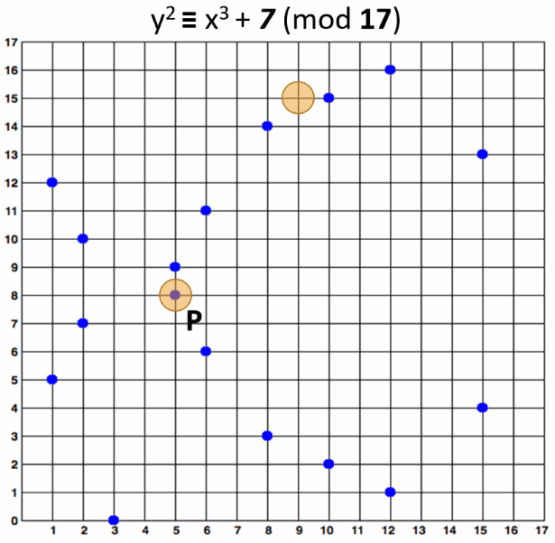

# Elliptic Curve Cryptography

The [**Elliptic Curve Cryptography (ECC)**](https://en.wikipedia.org/wiki/Elliptic-curve\_cryptography) is modern **family of public-key cryptosystems**, which is based on the algebraic structures of the **elliptic curves over finite fields** and on the difficulty of the [**Elliptic Curve Discrete Logarithm Problem (ECDLP)**](https://en.wikipedia.org/wiki/Elliptic-curve\_cryptography#Rationale).

**ECC** implements all major capabilities of the asymmetric cryptosystems: **encryption**, **signatures** and **key exchange**.

The **ECC cryptography** is considered a natural modern **successor of the RSA** cryptosystem, because ECC uses **smaller keys** and signatures than RSA for the same level of security and provides very **fast key generation**, **fast key agreement** and **fast signatures**.

## ECC Keys

The **private keys** in the ECC are integers (in the range of the curve's field size, typically **256-bit** integers). Example of 256-bit ECC private key (hex encoded, 32 bytes, 64 hex digits) is: `0x51897b64e85c3f714bba707e867914295a1377a7463a9dae8ea6a8b914246319`.

The **key generation** in the ECC cryptography is as simple as securely generating a **random integer** in certain range, so it is extremely fast. Any number within the range is valid ECC private key.

## Elliptic Curves

In mathematics [**elliptic curves**](http://mathworld.wolfram.com/EllipticCurve.html) are plane algebraic curves, consisting of all points {_**x**_, _**y**_}, described by the equation:

Cryptography uses **elliptic curves** in a simplified form (Weierstras form), which is defined as:

* y2 = x3 + \_**a**\_x + _**b**_

This is a visualization of the above elliptic curve:

### Elliptic Curves over Finite Fields

The **elliptic curve cryptography (ECC)** uses **elliptic curves over the** [**finite field**](https://en.wikipedia.org/wiki/Finite\_field) **𝔽p** (where _**p**_ is prime and _**p**_ > 3) or **𝔽2**_**m**_ (where the fields size _**p**_ = 2\_**m**\_). This means that the field is a **square matrix** of size _**p**_ x _**p**_ and the points on the curve are limited to **integer coordinates** within the field only. All algebraic operations within the field (like point addition and multiplication) result in another point within the field. The elliptic curve equation over the finite field **𝔽p** takes the following modular form:

* y2 ≡ x3 + \_**a**\_x + _**b**_ (mod _**p**_)

**Example** of elliptic curve over the finite field

* y2 ≡ x3 + **7** (mod **17**)

Note that the elliptic curve over finite field y2 ≡ x3 + **7** (mod **17**) consists of the **blue points** at the above figure, i.e. in practice the "_elliptic curves_" used in cryptography are "_sets of points in square matrix_", not classical "_curves_".

The above curve is "_educational_". It provides **very small key length** (4-5 bits). In the real world developers typically use curves of 256-bits or more.

### Elliptic Curves over Finite Fields: Calculations

It is pretty easy to calculate whether **certain point belongs to certain elliptic curve** over a finite field. For example, a point {_**x**_, _**y**_} belongs to the curve y2 ≡ x3 + **7** (mod **17**) when and only when:

* x3 + **7** - y2 ≡ 0 (mod **17**)

The point **P** {**5**, **8**} **belongs** to the curve, because `(5**3 + 7 - 8**2) % 17 == 0`. The point {**9**, **15**} **does not belong** to the curve, because `(9**3 + 7 - 15**2) % 17 != 0`. These calculations are in Python style. The above mentioned elliptic curve and the points {**5**, **8**} and {**9**, **15**} are visualized below:

### Multiplying ECC Point by Integer

Two points over an elliptic curve (EC points) can be **added** and the result is another point. This operation is known as **EC point addition**. If we add a point **G** to itself, the result is **G** + **G** = **2** \* **G**. If we add **G** again to the result, we will obtain **3** \* **G** and so on. This is how **EC point multiplication** is defined.

A point **G** over an elliptic curve over finite field (EC point) can be **multiplied by an integer** **k** and the result is another EC point **P** on the same curve and this operation is **fast**:

* **P** = **k** \* **G**

For **example** let's take the EC point **G** = {**15**, **13**} on the elliptic curve over finite field y2 ≡ x3 + **7** (mod **17**) and multiply it by **k** = **6**. We shall obtain an EC point **P** = {**5**, **8**}:

* **P** = **k** \* **G** = **6** \* {**15**, **13**} = {**5**, **8**}

The below figure visualizes this example of EC point multiplication:

### Order and Cofactor of Elliptic Curve

Аn elliptic curve over a finite field can form a finite [**cyclic algebraic group**](https://en.wikipedia.org/wiki/Cyclic\_group), which consists of all the points on the curve. In a cyclic group, if two EC points are added or an EC point is multiplied to an integer, the result is another EC point from the same cyclic group (and on the same curve). The **order of the curve** is the **total number of all EC points** on the curve. This total number of points includes also the special point called "[_**point at infinity**_](https://en.wikipedia.org/wiki/Point\_at\_infinity)", which is obtained when a point is multiplied by 0.

The **cofactor** is typically expressed by the following formula:

* **h** = **n** / **r**

where

* **n** is the **order of the curve** (the number of all its points)
* **h** is the curve **cofactor** (the number of non-overlapping **subgroups** of points, which together hold all curve points)
* **r** is the **order of the subgroups** (the number of points in each subgroup, including the _**infinity**_ point for each subgroup)
----
This is the concept of Elliptic Curve Cryptography that I applied on my Algorithm. Thank you 🖐️
----
---
